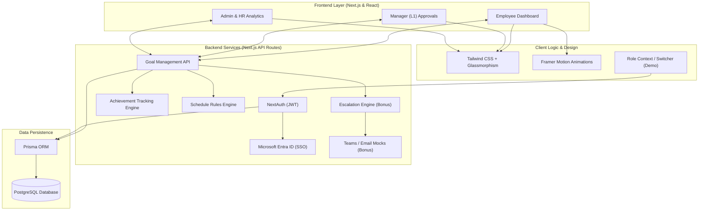

# GoalSync AI - System Architecture

This diagram illustrates the high-level architecture and technology choices for GoalSync AI. We have prioritized a highly scalable, serverless-ready architecture optimized for low-latency web interactions and seamless organizational scalability.

### Justification of Technology Stack & Hosting (Cost Optimisation)

1. **Next.js (App Router) + Vercel**: By using a unified full-stack framework, we eliminate the need to run and maintain a separate Node.js server. Next.js API routes run as serverless functions, meaning we only pay for exact compute time, heavily reducing idle hosting costs.
2. **PostgreSQL + Prisma**: PostgreSQL offers enterprise-grade relational integrity. Paired with Prisma ORM, we achieve type-safe database queries. A managed DB (e.g., Supabase) perfectly compliments this setup with a generous free tier for scaling up to the first 10,000 employees.
3. **Microsoft Entra ID**: Leveraging NextAuth with Azure AD provides Fortune 500-level security (SSO, MFA) without the overhead of building a custom identity provider.
4. **Tailwind CSS & Framer Motion**: Delivers a rich, "Glassmorphic" premium aesthetic with zero-configuration CSS bloat, guaranteeing extremely fast client-side rendering times.
